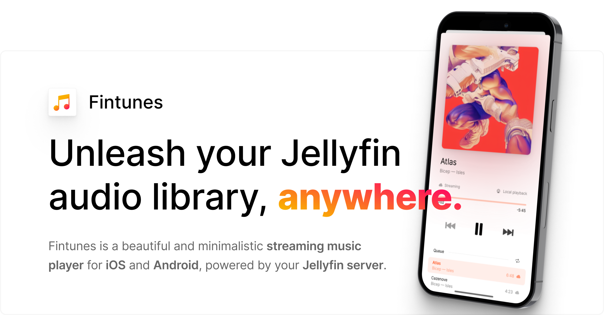
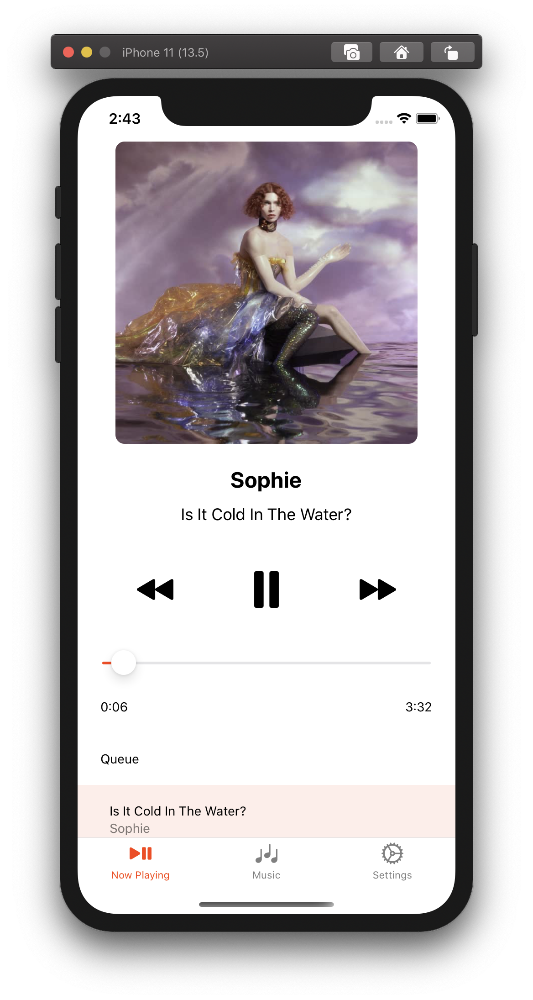
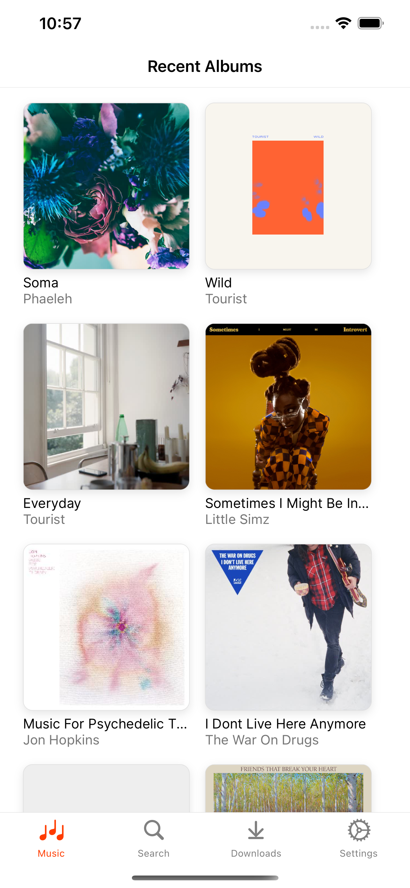
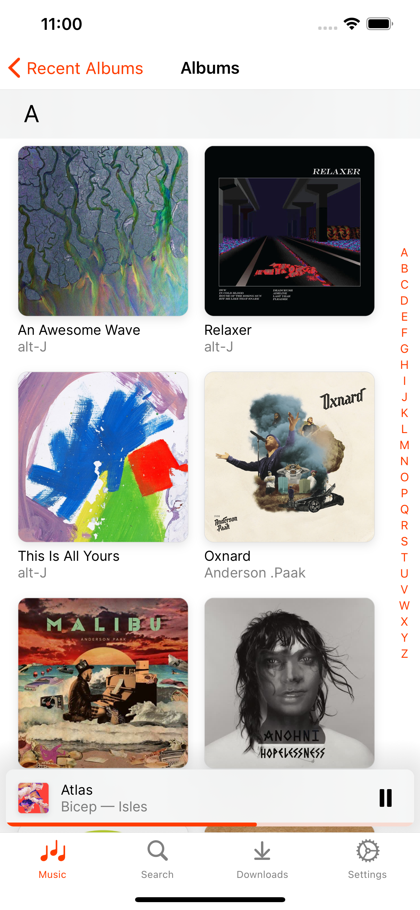
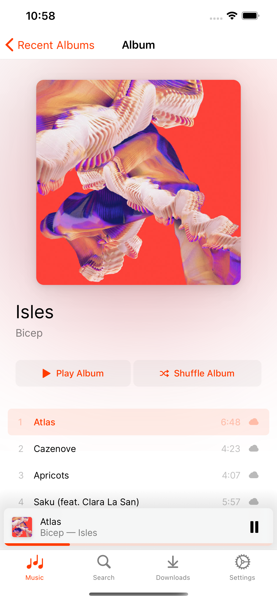
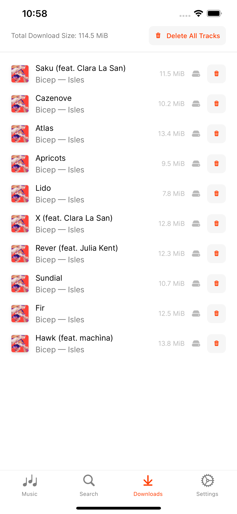
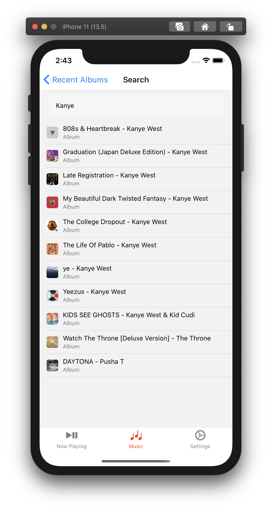
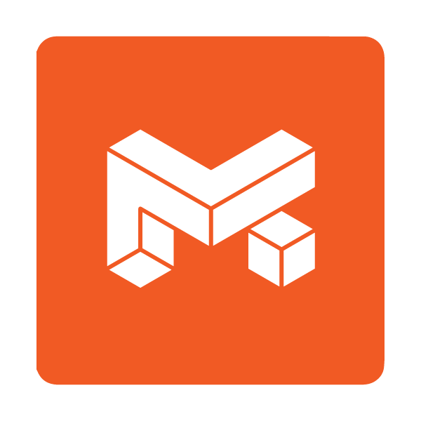

<div align="center">



[](https://apple.co/3MFYIJH)

[](https://github.com/leinelissen/jellyfin-audio-player/releases/latest)
[](https://apple.co/3MFYIJH)

[](./LICENSE.md)
[](https://discord.gg/xyd97GpC4Q)
  
<br />

With Fintunes, you can stream your Jellyfin audio library in full quality. List or search through your favourite tracks, albums and playlists. Stream to speakers and TVs wirelessly via either **AirPlay** or **Chromecast**. **Download** your favourite tracks and play them back, even when you are offline. Available in both a **dark and a light mode**, based on your operating system settings.

<br />
<br />
  
</div>

|||
|-|-|-|
|||

## Getting Started
Fintunes is available on the [App Store](https://apple.co/3MFYIJH). It is in the process of being released on both Google Play and F-Droid. You can also grab either an APK or IPA from the [release page](https://github.com/leinelissen/jellyfin-audio-player/releases/latest). If you are feeling frisky, you can compile Fintunes from source using the settings below.

### Using the app
You will need to setup your Jellyfin account for the application to be able to pull in all your audio. To do this, go over to the "Settings" tab and click the "Set Jellyfin server"-button. A modal will pop up in which you will enter your Jellyfin server URL, after which you enter your credentials in the provided browser view. When the app detects your credentials, they will automatically be remembered for the future.

## Building from source
### Prerequisites
This project is built on React Native, and first of all requires [NodeJS](https://nodejs.org/en/) to be installed. After installing it and cloning this repository, don't forget ton run `npm install` on your command line, so that all Node dependencies are installed.

#### iOS Prerequisites
[XCode](https://developer.apple.com/download/) is required to build the iOS application. It also comes bundles with iOS simulators which make development exceedingly easy. This does mean that iOS development is limited to macs.

#### Android prerequisites
[Android Studio](https://developer.android.com/studio/install) is recommended for development as it includes the Android SDK as well as Android Simulators for devleopment. At the very least, installing the Android SDK is neccessary for building any version of the app.

### Development Build
As soon as all prerequisites are covered, you can start development in either iOS or Android simulators by running the following
```
npm run ios
npm run android
```

### Production Build
This project is configured using [Fastlane](https://docs.fastlane.tools/), which allows for easy IPA and APK generation. To get started with this, make sure you install Fastlane first either using bundler (see below), or alternatively via e.g. Homebrew ([see supported methods](https://docs.fastlane.tools/getting-started/ios/setup/)).
```
gem install bundler
bundle install -j 6
```
When fastlane is setup, you can run either commands for generating IPA (iOS) or APK (Android) bundles.
```
fastlane ios beta
fastlane android beta
```

## Licensing and Credits
This work is licensed under the MIT license and was built by Lei Nelissen.

<a href="https://bmd.studio">
    
</a>

An Apple Developer license, as well as various forms of support are graciously provided for by [BMD Studio](https://bmd.studio), experts in finding creative solutions for difficult problems.